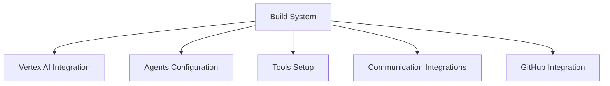

# HBIA2 Project Dashboard

<!-- TODO: Track HBIA2 Project Progress
created::2025-03-02T12:00:00Z
priority::high
due::2025-04-05T00:00:00Z
owner::@dionedge
estimate::2h
project::hbia2
-->

## Project Overview
- **Status**: In Progress
- **Start Date**: 2025-03-02
- **Target Completion**: 2025-04-05
- **Total Estimated Hours**: 46h

## Project Cards Status

### 1. Decommission Looker Agent
- **Priority**: High
- **Due**: 2025-03-15
- **Estimate**: 8h
- **Status**: Not Started
- **Dependencies**: None
- **Progress**: 0%

### 2. Build System
- **Priority**: High
- **Due**: 2025-03-20
- **Estimate**: 16h
- **Status**: Not Started
- **Dependencies**: None
- **Progress**: 0%

### 3. Vertex AI Integration
- **Priority**: High
- **Due**: 2025-03-25
- **Estimate**: 12h
- **Status**: Not Started
- **Dependencies**: Build System
- **Progress**: 0%

### 4. Agents Configuration
- **Priority**: High
- **Due**: 2025-03-25
- **Estimate**: 6h
- **Status**: Not Started
- **Dependencies**: Build System
- **Progress**: 0%

### 5. Tools Setup
- **Priority**: High
- **Due**: 2025-03-25
- **Estimate**: 6h
- **Status**: Not Started
- **Dependencies**: Build System
- **Progress**: 0%

### 6. Communication Integrations
- **Priority**: Medium
- **Due**: 2025-03-30
- **Estimate**: 6h
- **Status**: Not Started
- **Dependencies**: Build System
- **Progress**: 0%

### 7. GitHub Integration
- **Priority**: Medium
- **Due**: 2025-04-05
- **Estimate**: 4h
- **Status**: Not Started
- **Dependencies**: Build System
- **Progress**: 0%

## Timeline
```
March 2025
15th: Decommission Looker Agent
20th: Build System
25th: Vertex AI Integration, Agents, Tools
30th: Communication Integrations

April 2025
5th: GitHub Integration
```

## Dependencies


## Project Cards
- [Decommission Looker Agent](hbia2-decommission_looker_agent.md)
- [Build System](build_hbia2.md)
- [Vertex AI Integration](hbia2_vertex_ai.md)
- [Agents Configuration](hbia2_agents.md)
- [Tools Setup](hbia2_tools.md)
- [Communication Integrations](hbia2_integrations.md)
- [GitHub Integration](hbia2_github.md)

## Notes
- All high-priority tasks should be completed before starting medium-priority tasks
- Build System is the foundation for other integrations
- Regular updates to this dashboard will track overall progress

#hbia2 #project_management #dashboard #tracking
<!--
order::-450
TODO::2025-03-03T11:08:50.872Z
-->